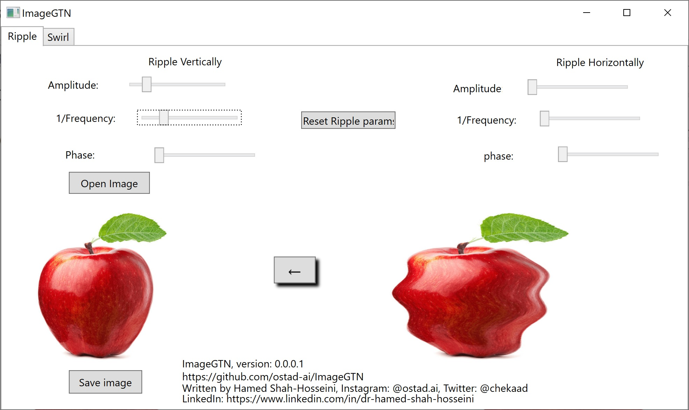
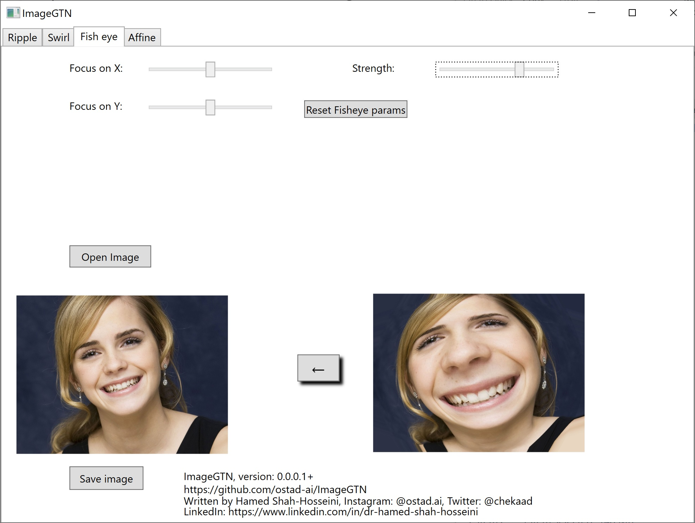
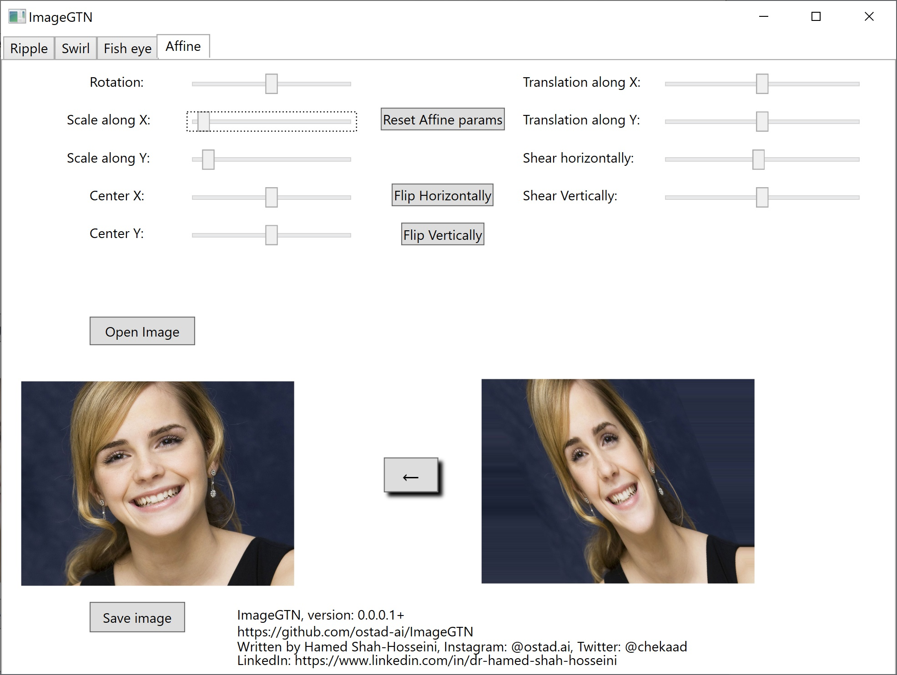
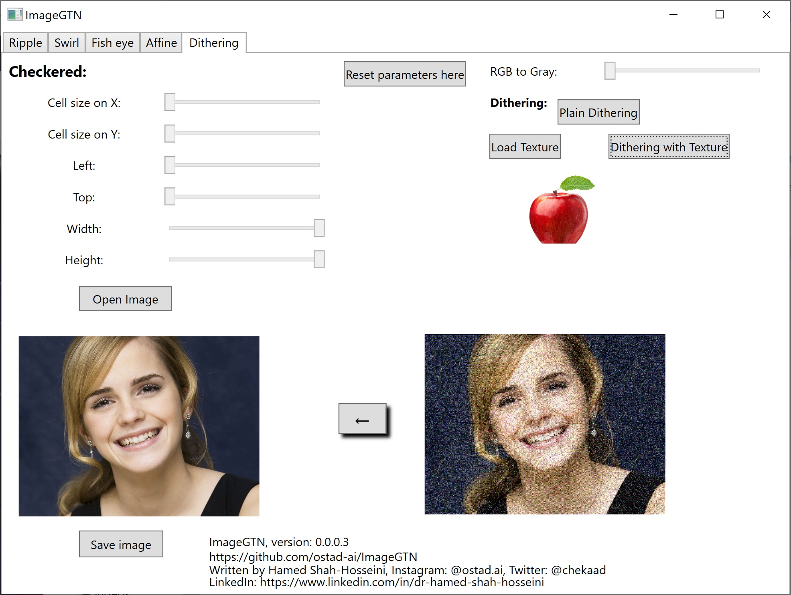
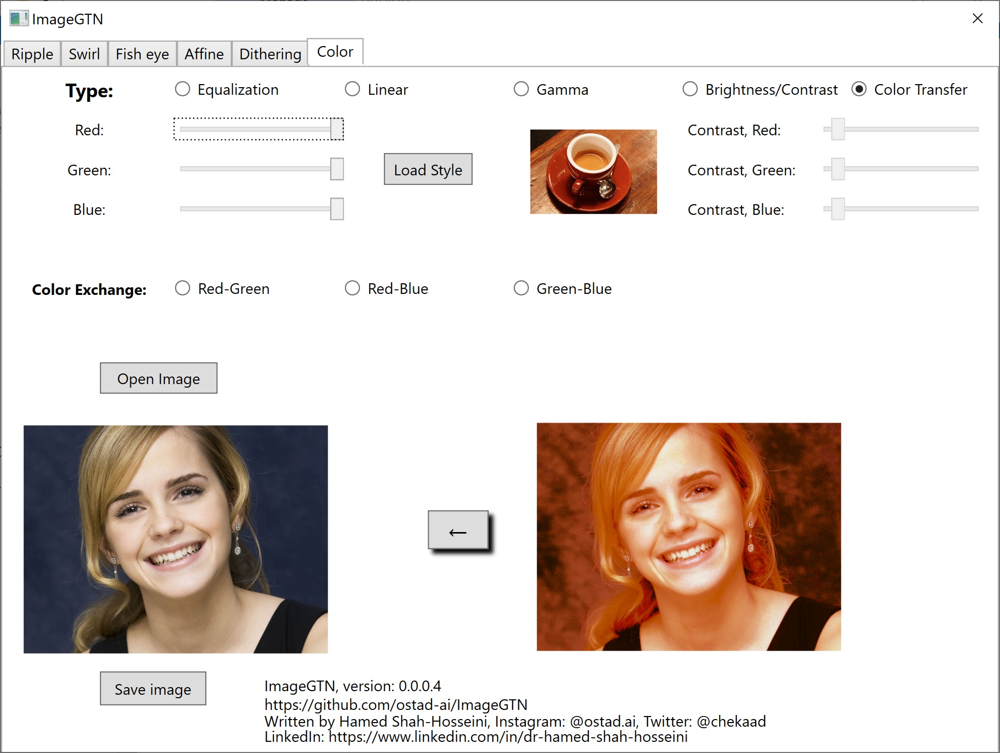
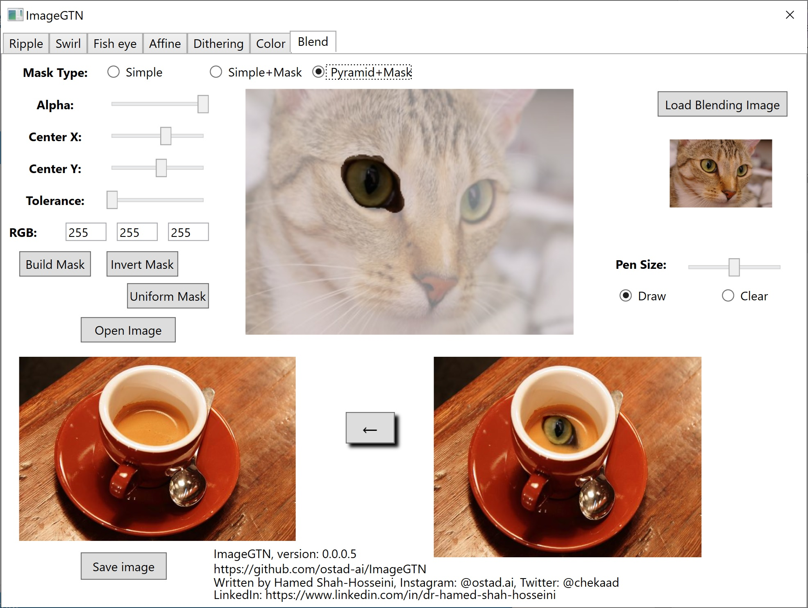
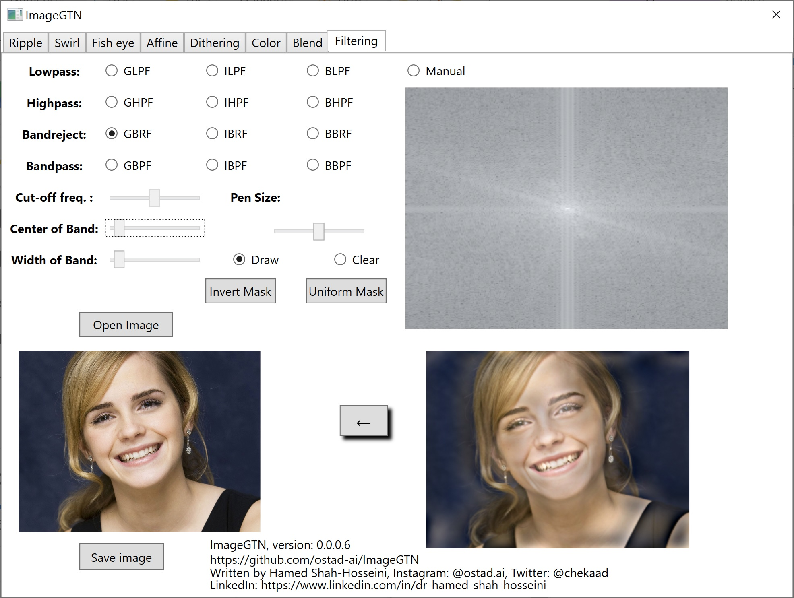
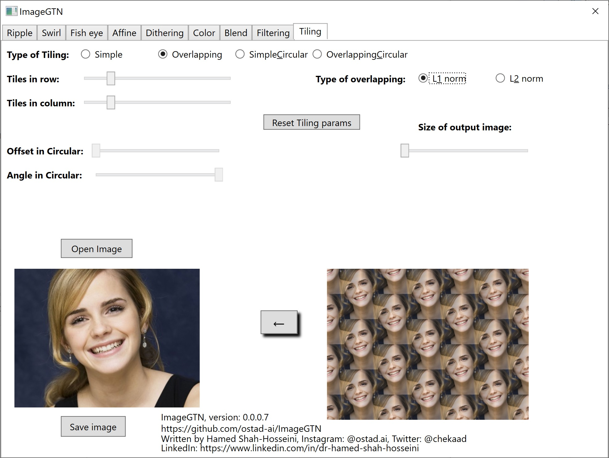
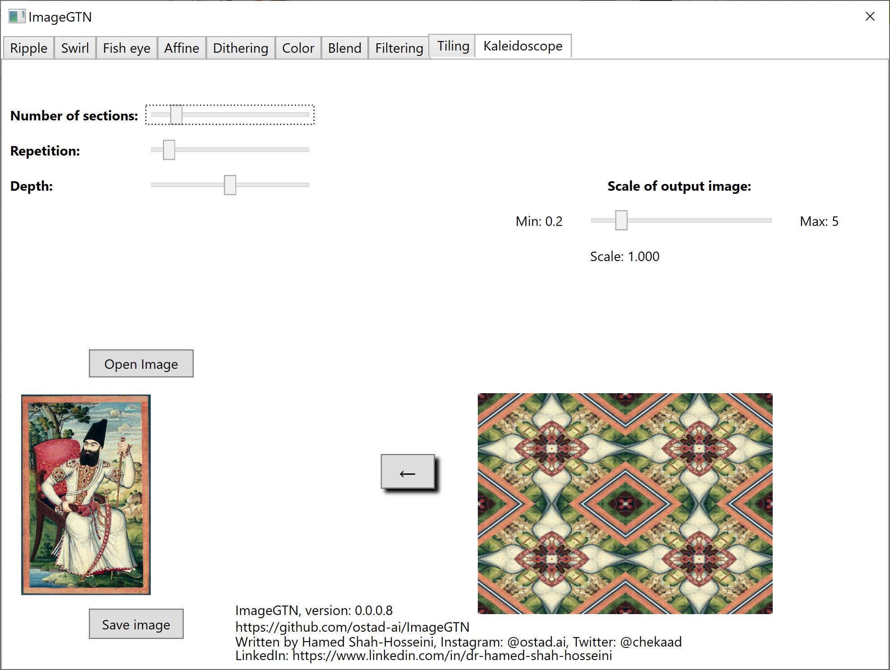

# ImageGTN
### Newest, Version 0.0.0.8
1. Kaleidoscope using an input image is added to the new update.
## This executable program is for manipulating images.
[Download the stand-alone program for win64](https://drive.google.com/file/d/1LXXYUCPtZvVYmk7qx97YoNA41vW4A14C/view?usp=sharing)
### Earlier, version 0.0.0.7
1. Tiling with one image is included in the new update with different techniques.
### Earlier, version 0.0.0.6
1. Filtering section has been added to the program.
### Earlier, Version 0.0.0.5
1. Image Blending is added.
### Earlier, Version 0.0.0.4
1. Added color tab for manipulationg colors.
2. Also, color transfer is included too.
3. A new warp is added to the fisheye.
### Earlier, Version: 0.0.0.3
1. Added Dithering, and Checkered effects.
2. fisheye is augmented with more warps.
---
---
 *Figure 1: A snapshot of Swirling.*
---
 *Figure 2: A snapshot of Rippling vertically.*
---
 *Figure 3: A snapshot of Fisheye.*
---
 *Figure 4: A snapshot of Affine Transformation.*
---
 *Figure 5: A snapshot of Dithering Transformation.*
---
 *Figure 6: A snapshot of Color Modification.*
---
 *Figure 7: A snapshot of Image Blending.*
---
 *Figure 8: A snapshot of Image Filtering.*
---
 *Figure 9: A snapshot of Image Tiling.*
---
 *Figure 10: A snapshot of doing Kaleidoscope on an input image.*
---